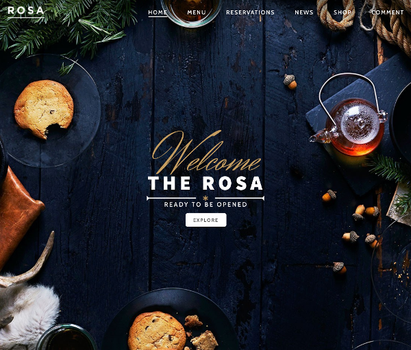
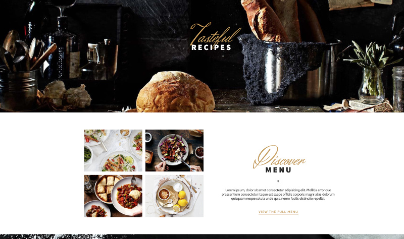

<!-- AUTO-GENERATED-CONTENT:START (STARTER) -->
<p align="center">
  <a href="https://www.gatsbyjs.org">
    
  </a>
</p>
<h1 align="center">
  Rosa Theme
</h1>

Reproduce the Rosa WP Theme using Gatsby JS.

## 🚀 Demo

https://template-restaurant.netlify.app/#

1.  **Start developing.**

    Navigate into your new site’s directory and start it up.

    ```shell
    cd gatsby-template-restaurant/
    gatsby develop
    ```

2.  **Open the source code and start editing!**

        Your site is now running at `http://localhost:8000`!


<p align="center">
    
</p>
